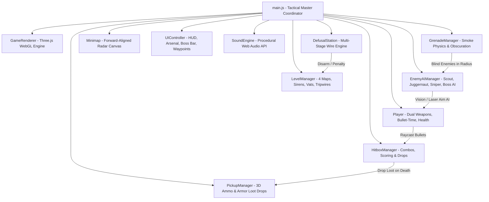

<div align="center">

# 🎯 OPERATION: DEFUSE — v2.0 Tactical Overhaul
### 3D Tactical Stealth First-Person Shooter & Bomb Disarmament Simulation

[](https://snigdha-0210.github.io/Shoot_Game/)
[](https://snigdha-0210.github.io/Shoot_Game/)
[](https://threejs.org/)
[](https://vitejs.dev/)
[](LICENSE)

<br/>

## 🕹️ **[👉 CLICK HERE TO PLAY THE GAME ONLINE NOW 👈](https://snigdha-0210.github.io/Shoot_Game/)**
**Live URL:** [https://snigdha-0210.github.io/Shoot_Game/](https://snigdha-0210.github.io/Shoot_Game/)

<br/>

<p align="center">
  <em>An atmospheric, tactical first-person stealth shooter and bomb defusal game built with Three.js and Vite. Infiltrate hostile enemy sectors under cover of darkness, neutralize armed guards with precision headshots, throw tactical smoke grenades, activate adrenaline bullet-time focus, disarm tricky multi-wire bombs, and conquer boss encounters across 4 sectors.</em>
</p>

[🎮 Play Online](https://snigdha-0210.github.io/Shoot_Game/) • [🌟 Features](#-key-features) • [🪖 Enemy Classes](#-4-specialized-enemy-archetypes) • [🕹️ Controls](#-controls--keybindings) • [🏗️ Architecture](#-system-architecture) • [✂️ Defusal Guide](#-field-manual--wire-defusal-solutions) • [🚀 Quick Start](#-quick-start--installation)

---

</div>

## 🌟 Key Features

- **🔫 Dual-Weapon Arsenal & Quick Swap (<kbd>Q</kbd> / <kbd>1</kbd> / <kbd>2</kbd>)**:
  - **Primary**: *Suppressed M4A1-S Carbine* (30 rounds, 5.56 NATO, high precision & long-range scope).
  - **Secondary**: *Suppressed USP-45 Tactical Pistol* (12 rounds, .45 ACP, fast draw, high close-quarters burst damage).
- **💨 Tactical Smoke Grenades (<kbd>G</kbd>)**:
  - Realistic throwing physics that detonates into a 3D volumetric smoke particle cloud, blinding enemies and blocking line-of-sight for 14 seconds.
- **⚡ Adrenaline Focus Mode (Bullet-Time <kbd>Space</kbd>)**:
  - Triggers **0.35x cinematic slow-motion time dilation** with heartbeat audio to line up precision headshots during intense firefights.
- **💥 Killstreak Combos & Stealth Scoring**:
  - 🎯 **Headshot Kill**: **`+15 Points`** (High-precision head hitbox, instant critical kill, golden hitmarker & chime).
  - 🔥 **Combo Multipliers**: Successive headshots within 3.5s trigger **`COMBO x2!`**, **`COMBO x3!`**, **`UNSTOPPABLE!`** (+30, +45, +60 pts).
  - 🤫 **Silent Assassin**: Eliminating unaware guards awards **`+25 SILENT ASSASSIN`** bonus points.
  - 💥 **Body Shot**: **`+5 Points`** (Torso/limb hitboxes, damage staggering).
  - 🩸 **Enemy Hit on Operative**: **`-3 Points`** penalty per hit taken.
  - 💣 **Bomb Defused**: **`+100 Points`** + Remaining Time Bonus.
- **🎁 3D Loot Drops (Ammo & Armor)**: Defeated enemies drop glowing spinning **Ammo Crates** (+15 ammo) and **Armor Trauma Kits** (+25 HP) with magnetic collection proximity.
- **🛡️ 3 Tactical Armor Lifelines**: 3 Kevlar Armor Plates with an active **100% Health Bar** per life.
- **💣 Interactive Tricky Bomb Defusal Mini-Game**: Realistic wire-cutting station with procedural colored wires (Red, Blue, Yellow, Green, White, Black, Striped) and Field Manual logic rules.
- **🏙️ 4 Progressive Sectors with Cinematic Set-Pieces**:
  - **Level 1**: Rainy cobblestones, street lanterns, and neon sign (`BAR NOCTURNE`).
  - **Level 2**: Spinning red emergency alert sirens, server racks with animated LEDs.
  - **Level 3**: Glowing toxic radioactive coolant vats with bubbling foam and elevated catwalks.
  - **Level 4**: Polished obsidian marble, security laser tripwires, and 3D holographic war table.

---

## 🪖 4 Specialized Enemy Archetypes

| Enemy Class | Armor & HP | Weaponry | Threat Profile & Behavior |
| :--- | :--- | :--- | :--- |
| 🏃 **Patrol Scout** | Light (25 HP) | Suppressed SMG | Fast movement speed, quick flank maneuvers, rapid burst fire. |
| 🛡️ **Heavy Juggernaut** | Heavy Tank (60 HP) | Heavy Assault Rifle | Full plate armor & riot helmet (requires 2 headshots or 5 body hits), relentless advance. |
| 🎯 **Catwalk Sniper** | Medium (30 HP) | High-Caliber Marksman | Perched on catwalks; projects a **visible red laser beam**. Locks on for 1.5s before a 45-dmg shot! |
| 👑 **Citadel Boss** | Boss Rig (80 Shield + 60 HP) | Dual Heavy Carbine | Holographic energy shield, tactical burst fire, defensive rolls, and reinforcement alarms. |

---

## 🕹️ Controls & Keybindings

| Key / Control | Action Description |
| :---: | :--- |
| <kbd>W</kbd> <kbd>A</kbd> <kbd>S</kbd> <kbd>D</kbd> | Move Operative (Forward, Left, Backward, Right) |
| <kbd>MOUSE</kbd> | First-Person Look & Aim (PointerLock) |
| <kbd>LMB</kbd> | Fire Active Weapon |
| <kbd>RMB</kbd> | Aim Down Sights (ADS) Precision Zoom |
| <kbd>Q</kbd> or <kbd>1</kbd> / <kbd>2</kbd> | Quick-Swap Weapon (M4A1-S Carbine $\leftrightarrow$ USP-45 Pistol) |
| <kbd>G</kbd> | Throw Tactical Smoke Grenade |
| <kbd>Space</kbd> | Activate Adrenaline Focus Mode (Bullet-Time Slow-Mo) |
| <kbd>C</kbd> / <kbd>Ctrl</kbd> | Crouch (Silent Stealth Stance, Zero Acoustic Noise) |
| <kbd>Shift</kbd> | Sprint (High Speed, Generates Radar Acoustic Footsteps) |
| <kbd>R</kbd> | Tactical Weapon Reload |
| <kbd>F</kbd> | Toggle Tactical Weapon Flashlight |
| <kbd>E</kbd> | Open Bomb Disarmament Terminal (within 4.0m) |
| <kbd>Esc</kbd> | Exit Defusal Station or Pause Menu |

---

## 🏗️ System Architecture



---

## ✂️ Field Manual — Wire Defusal Solutions

Use this quick-reference guide to rapidly disarm bombs across all 4 sectors:

### Level 1: Coastal Infiltration Yard
- **Bomb Type:** Mk-I Tactical C4 (3 Wires: Red, Blue, Yellow | Serial: `8K4-T7`)
- **Solution:** Cut **`Wire #2 (BLUE)`**
- **Outcome:** Sector 1 Defused $\rightarrow$ Unlocks Level 2 (+100 Defusal Bonus + Time Bonus).

### Level 2: Subterranean Bunker & Server Complex
- **Bomb Type:** Digital Circuit Timer (4 Wires: Red, Blue, White, Black | Serial: `3V9-B2`)
- **Solution:** Cut **`Wire #2 (BLUE)`**
- **Outcome:** Sector 2 Defused $\rightarrow$ Unlocks Level 3.

### Level 3: Research Silo & Catwalks
- **Bomb Type:** 2-Stage Bio-Chemical Detonator (5 Wires: Striped, Red, Yellow, Green, Blue | Serial: `5S8-X4`)
- **Solution (2-Stage Sequence):**
  1. Cut **`Wire #1 (STRIPED)`** *(Ground bypass disarmed)*
  2. Cut **`Wire #4 (GREEN)`** *(Capacitor neutralized)*
- **Outcome:** Sector 3 Defused $\rightarrow$ Unlocks Level 4.

### Level 4: Fortress Command Citadel
- **Bomb Type:** Master Omega Citadel Core (6 Wires: Red, Striped, Blue, Yellow, White, Green | Serial: `9X0-OMEGA`)
- **Solution (3-Stage Omega Directive Sequence):**
  1. Cut **`Wire #1 (RED)`** *(Primary power feed disrupted)*
  2. Cut **`Wire #5 (WHITE)`** *(Core oscillations halted)*
  3. Cut **`Wire #6 (GREEN)`** *(Terminal ground severed)*
- **Outcome:** **Grand Victory Screen** — All 4 sectors secured with **Master Shadow Commando (S-Rank)** commendation!

---

## 🚀 Quick Start & Installation

```bash
# 1. Clone the repository
git clone https://github.com/Snigdha-0210/Shoot_Game.git
cd Shoot_Game

# 2. Install dependencies
npm install

# 3. Start local development server
npm run dev

# 4. Open in browser
# Navigate to http://localhost:5173/
```

---

---

## 📂 Project Structure

```
Shoot_Game/
├── index.html                  # Main UI, HUD overlays, Defusal Station modal & briefing screens
├── package.json                # Three.js r170 & Vite 6 dependencies
├── LICENSE                     # MIT License
├── README.md                   # Complete game documentation & architecture
├── PROJECT_UPDATES.md          # Comprehensive progress changelog & technical roadmap
└── src/
    ├── main.js                 # Master game state coordinator & main loop
    ├── style.css               # Tactical glassmorphism styling, HUD, radar & animations
    ├── engine/
    │   ├── Audio.js            # Pure Web Audio API procedural sound synthesizer
    │   ├── Input.js            # PointerLock mouse aim, WASD, crouch, sprint & ADS input
    │   ├── Renderer.js         # Three.js WebGL renderer, moonlight, shadows, linear fog & particles
    │   └── TextureGenerator.js # Procedural canvas textures (wet cobblestone, brick facades, circuits)
    └── game/
        ├── Player.js           # First-person character controller, dual weapons, adrenaline & health
        ├── Enemy.js            # 3D models for 4 enemy archetypes (Scout, Juggernaut, Sniper, Boss)
        ├── EnemyAI.js          # Tactical AI (sniper laser tracking, juggernaut advance, smoke blindness)
        ├── Grenade.js          # Tactical smoke grenade physics & 3D volumetric smoke clouds
        ├── Pickups.js          # 3D spinning glowing Ammo & Armor loot drop pickups
        ├── HitboxManager.js    # Raycast hit detection, combo killstreaks (+15, +30, +45, +60), stealth bonus
        ├── Bomb.js             # 3D Bomb model, digital clock, LED diodes & 18m sky beacon
        ├── DefusalStation.js   # Interactive wire-cutting puzzle mini-game & Field Manual
        ├── LevelManager.js     # 4 base sectors (sirens, neon signs, radioactive vats, laser tripwires)
        ├── Minimap.js          # Forward-aligned tactical radar canvas
        └── UI.js               # HUD overlays, equipment slots, boss bar, 3D waypoints & toasts
```

---

## 📄 License

This project is licensed under the **MIT License** — see the [LICENSE](LICENSE) file for details.

Developed with ❤️ using **Three.js** and **Vite**.

