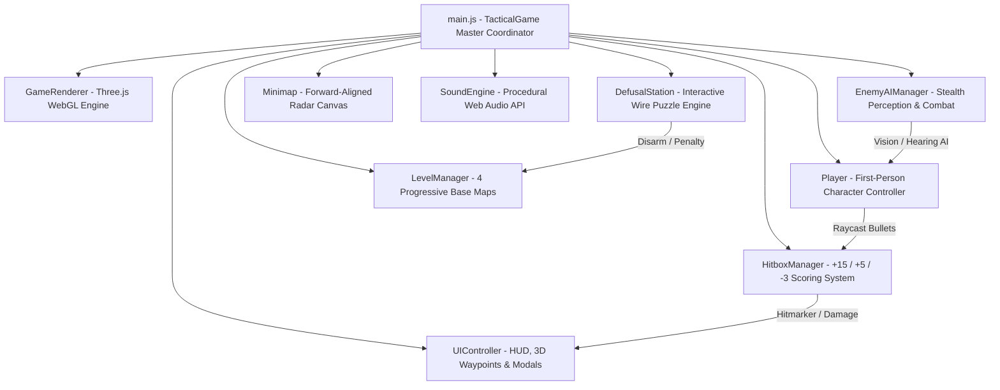
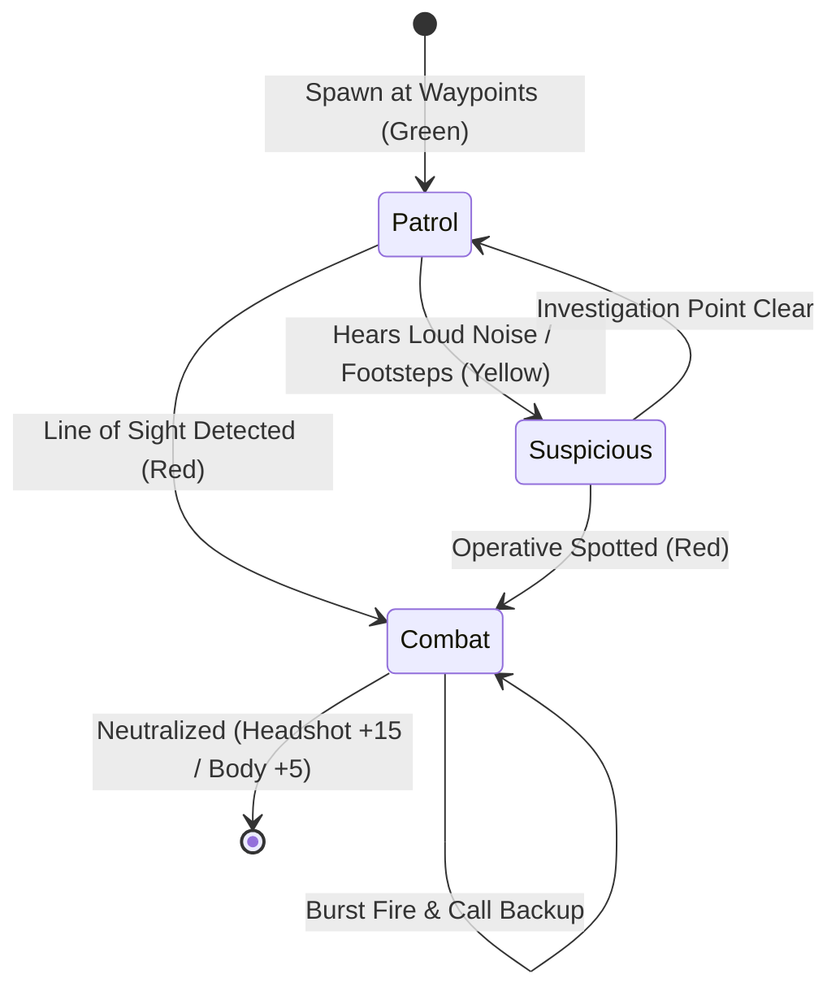

<div align="center">

# 🎯 OPERATION: DEFUSE
### Tactical 3D Stealth FPS & Multi-Level Bomb Disarmament Simulation

[](https://threejs.org/)
[](https://vitejs.dev/)
[](https://developer.mozilla.org/en-US/docs/Web/JavaScript)
[](LICENSE)
[]()

<p align="center">
  <em>An atmospheric, tactical first-person stealth shooter and bomb defusal game built from the ground up with Three.js and Vite. Infiltrate hostile enemy sectors under cover of darkness, neutralize armed guards with precision headshots, track down high-yield explosives, and disarm tricky multi-wire bombs before the timer detonates.</em>
</p>

[🎮 Features](#-key-features) • [🕹️ Controls](#-controls--keybindings) • [🏗️ Architecture](#-system-architecture) • [🗺️ Levels](#-4-progressive-mission-sectors) • [✂️ Defusal Guide](#-field-manual--wire-defusal-solutions) • [🚀 Quick Start](#-quick-start--installation)

---

</div>

## 🌟 Key Features

- **Tactical Stealth & Acoustic Perception**: Operative crouch-walking produces **0 noise** for silent takedowns; sprinting triggers acoustic radar ripples that alert nearby guards.
- **Precision Combat & Scoring**:
  - 🎯 **Headshot**: **`+15 Points`** (High-precision 3D head hitbox, instant critical kill, golden skull hitmarker & high-tech chime).
  - 💥 **Body Shot**: **`+5 Points`** (Torso/limb hitboxes, damage staggering).
  - 🩸 **Enemy Hit on Operative**: **`-3 Points`** penalty per hit taken, directional damage screen flash, and armor reduction.
  - 💣 **Bomb Defused**: **`+100 Points`** + Remaining Time Bonus.
- **3 Tactical Armor Lifelines**: 3 Kevlar Armor Plates with an active **100% Health Bar** per life. Exhausting all 3 lifelines triggers Mission Failed.
- **Interactive Tricky Bomb Defusal Mini-Game**: Reaching within 4.0m of the bomb allows opening the close-up **Disarmament Terminal** with procedural colored wires (Red, Blue, Yellow, Green, White, Black, Striped), serial numbers, and Field Manual logic rules.
- **4 Progressive Base Sectors**: From rainy European cobblestone alleyways to underground server bunkers, toxic chemical silos, and fortified command citadels.
- **Web Audio Procedural Sound Engine**: Crisp suppressed gunshots, enemy AK-47 bursts, headshot kill chimes, heartbeat tension audio, bomb ticking, and wire-cutting sound effects.
- **Augmented Reality 3D Waypoint Tracking & Minimap**: Real-time forward-aligned radar minimap and 3D screen-space floating target tags with directional pointer arrows.

---

## 🏗️ System Architecture



### AI Perception State Machine



---

## 🗺️ 4 Progressive Mission Sectors

| Level | Sector Name | Environment Theme | Enemy Squad | Bomb Unit | Time Limit |
| :---: | :--- | :--- | :---: | :---: | :---: |
| **1** | **Coastal Infiltration Yard** | Rainy European Cobblestone Alley, Historic Townhouses, Street Lamps | 3 Patrolling Guards | Mk-I Tactical C4 (3 Wires) | **90s** |
| **2** | **Subterranean Bunker** | Underground Metal Corridors, Server Racks, Red Emergency Lights | 5 Tactical Guards | Digital Circuit Bomb (4 Wires) | **80s** |
| **3** | **Research Silo & Catwalks** | Multi-Tier Catwalks, Toxic Coolant Vats, High-Tech Floodlights | 6 Armored Guards | 2-Stage Bio-Detonator (5 Wires) | **75s** |
| **4** | **Fortress Command Citadel** | Fortified Headquarters, Commander Boss, Command Pillars | 8 Elite Commandos | Master Omega Core (6 Wires) | **65s** |

---

## ✂️ Field Manual & Wire Defusal Solutions

```
========================================================================================
LEVEL 1: MK-I TACTICAL C4 (3 Wires: Red, Blue, Yellow | Serial: 8K4-T7)
Rule: Since Serial ends in an ODD digit (7) and a Blue wire is present:
👉 CUT: Wire #2 (BLUE)
========================================================================================
LEVEL 2: DIGITAL CIRCUIT TIMER (4 Wires: Red, Blue, White, Black | Serial: 3V9-B2)
Rule: RED LED is active with a single Red wire and Blue wire present:
👉 CUT: Wire #2 (BLUE)
========================================================================================
LEVEL 3: 2-STAGE BIO-CHEMICAL DETONATOR (5 Wires: Striped, Red, Yellow, Green, Blue)
Rule: Dual-wire sequence (Ground bypass -> Capacitor drain):
👉 STAGE 1: Cut Wire #1 (STRIPED)
👉 STAGE 2: Cut Wire #4 (GREEN)
========================================================================================
LEVEL 4: MASTER OMEGA CITADEL CORE (6 Wires: Red, Striped, Blue, Yellow, White, Green)
Rule: 3-Stage Omega Directive sequence:
👉 STAGE 1: Cut Wire #1 (RED)
👉 STAGE 2: Cut Wire #5 (WHITE)
👉 STAGE 3: Cut Wire #6 (GREEN)
========================================================================================
```

---

## 🕹️ Controls & Keybindings

| Action | Control | Description |
| :--- | :---: | :--- |
| **Movement** | <kbd>W</kbd> <kbd>A</kbd> <kbd>S</kbd> <kbd>D</kbd> | Navigate operative through sectors |
| **Aim / Look** | <kbd>Mouse</kbd> | 360° first-person view with pitch clamping |
| **Shoot** | <kbd>Left Click</kbd> | Fire suppressed M4A1 (🎯 +15 Head, 💥 +5 Body) |
| **Aim Down Sights (ADS)** | <kbd>Right Click (Hold)</kbd> | Tightens crosshair and centers holographic sight |
| **Stealth Crouch** | <kbd>C</kbd> or <kbd>Ctrl</kbd> | Drops acoustic noise to 0 (Silent Sneak) |
| **Sprint** | <kbd>Shift</kbd> | High-speed dash (Generates acoustic radar noise) |
| **Reload** | <kbd>R</kbd> | Reload 30-round 5.56 NATO magazine |
| **Flashlight Toggle** | <kbd>F</kbd> | Toggle weapon-mounted spotlight |
| **Defuse Bomb** | <kbd>E</kbd> / Click Prompt | Open Disarmament Terminal within 4.0m |
| **Pause / Exit Terminal** | <kbd>Esc</kbd> | Return to combat or open pause menu |

---

## 🚀 Quick Start & Installation

### Prerequisites
- [Node.js](https://nodejs.org/) (v18.0.0 or higher)
- `npm` (v9.0.0 or higher)

### Setup & Run

```bash
# 1. Clone the repository
git clone https://github.com/Snigdha-0210/Shoot_Game.git
cd Shoot_Game

# 2. Install dependencies
npm install

# 3. Launch development server
npm run dev

# 4. Open in browser
# Navigate to http://localhost:5173/
```

### Production Build

```bash
# Compile and bundle for production
npm run build

# Preview production build locally
npm run preview
```

---

## 📂 Project Structure

```
Shoot_Game/
├── index.html                  # Main UI, HUD overlays, Defusal Station modal & briefing screens
├── package.json                # Three.js r170 & Vite 6 dependencies
├── LICENSE                     # MIT License
├── README.md                   # Complete game documentation & architecture
├── PROJECT_UPDATES.md          # Comprehensive progress changelog & technical roadmap
└── src/
    ├── main.js                 # Master game state coordinator & main loop
    ├── style.css               # Tactical glassmorphism styling, HUD, radar & animations
    ├── engine/
    │   ├── Audio.js            # Pure Web Audio API procedural sound synthesizer
    │   ├── Input.js            # PointerLock mouse aim, WASD, crouch, sprint & ADS input
    │   ├── Renderer.js         # Three.js WebGL renderer, moonlight, shadows, linear fog & particles
    │   └── TextureGenerator.js # Procedural canvas textures (wet cobblestone, brick facades, circuits)
    └── game/
        ├── Player.js           # First-person character controller, M4A1 model, 3 lifelines & health
        ├── Enemy.js            # 3D SWAT Commando soldier models with NVG goggles & hitboxes
        ├── EnemyAI.js          # Perception system (vision cones, acoustic noise hearing, patrol & combat)
        ├── HitboxManager.js    # Raycast hit detection (+15 Headshot, +5 Body, -3 Enemy hit penalty)
        ├── Bomb.js             # 3D Bomb model, digital clock, LED diodes & 18m sky beacon
        ├── DefusalStation.js   # Interactive wire-cutting puzzle mini-game & Field Manual
        ├── LevelManager.js     # 4 base sector maps (Yard, Bunker, Silo, Citadel)
        ├── Minimap.js          # Forward-aligned tactical radar canvas
        └── UI.js               # HUD overlays, floating 3D screen waypoints & toasts
```

---

## 📄 License

This project is licensed under the **MIT License** — see the [LICENSE](LICENSE) file for details.

Developed with ❤️ using **Three.js** and **Vite**.
